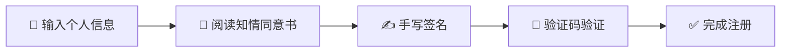

<div align="center">

# 🏥 甲肝患者信息登记系统

### 甲肝暴发流行预测预警模型构建及应用

[](LICENSE)
[](https://developer.mozilla.org/en-US/docs/Web/HTML)
[](https://angularjs.org/)
[](https://ionicframework.com/)
[](https://github.com)

**📱 基于 Web 的移动端应用 | 🔐 患者信息采集 | ✍️ 电子知情同意书签署**

[在线预览](http://demo.xiaowiba.com/demo/hepatitisA/hepatitisA/register/register.html) · [快速开始](#-快速开始) · [功能特性](#-功能特性)

</div>

---

## 📖 项目简介

这是一个专为甲型肝炎患者设计的信息登记与电子知情同意书签署系统。系统提供便捷的移动端操作界面，支持患者信息采集、手写签名、验证码验证等功能，确保数据采集的规范性和安全性。

## ✨ 功能特性

<table>
<tr>
<td width="50%">

### 📝 信息采集
- ✅ 患者姓名录入
- ✅ 手机号码验证
- ✅ 身份证号校验
- ✅ 实时表单验证

</td>
<td width="50%">

### ✍️ 电子签名
- ✅ Canvas 手写签名
- ✅ 患者本人签名
- ✅ 代理人签名支持
- ✅ 签名清除重写

</td>
</tr>
<tr>
<td width="50%">

### 🔐 安全验证
- ✅ 手机验证码验证
- ✅ 信息加密传输
- ✅ 隐私数据保护
- ✅ 安全存储机制

</td>
<td width="50%">

### 📋 同意管理
- ✅ 知情同意书展示
- ✅ 问卷访问授权
- ✅ 血样采集同意
- ✅ 完整流程追踪

</td>
</tr>
</table>

## 🛠️ 技术栈

<div align="center">

| 类别 | 技术 | 说明 |
|:---:|:---|:---|
| 🎨 **前端框架** | AngularJS + Ionic Framework | 移动端应用开发框架 |
| 💎 **UI 组件** | MUI (Mobile UI) | 移动端 UI 组件库 |
| ✏️ **手写签名** | Tablet.js | Canvas 写字板实现 |
| 📦 **工具库** | jQuery 2.2.4 | DOM 操作与事件处理 |
| 🖼️ **图片处理** | EXIF.js | 图片元数据读取 |
| 💬 **微信集成** | WeChat JS-SDK 1.2.0 | 微信浏览器功能支持 |
| ✨ **交互效果** | Ripple Effect | Material Design 波纹效果 |

</div>

## 📁 项目结构

```
hepatitisA/
├── index.html                          # 入口文件（重定向到注册页）
├── hepatitisA/
│   ├── register/
│   │   ├── register.html              # 注册主页面
│   │   └── resources/
│   │       ├── css/                   # 样式文件
│   │       ├── js/                    # 业务逻辑
│   │       └── img/                   # 图片资源
│   └── resources/
│       └── js/
│           └── app.js                 # AngularJS 应用配置
└── resources/
    ├── css/                           # 全局样式
    ├── js/                            # 公共 JS
    └── plugin/                        # 第三方插件库
```

## 🚀 快速开始

### 📥 本地运行

**1️⃣ 克隆项目到本地**
```bash
git clone [repository-url]
cd hepatitisA
```

**2️⃣ 启动本地服务器**

> 💡 推荐使用 Live Server 或其他 HTTP 服务器
```bash
# 使用 Python 简易服务器
python -m http.server 8080

# 或使用 Node.js http-server
npx http-server -p 8080
```

**3️⃣ 在浏览器中访问**
```
http://localhost:8080
```

### 📱 移动端调试

> 💡 **提示**: 建议使用浏览器的移动设备模拟器进行调试，或直接在移动设备上访问。

<details>
<summary>🔧 Chrome DevTools 调试步骤</summary>

1. 打开 Chrome 浏览器
2. 按 `F12` 打开开发者工具
3. 点击设备工具栏图标（或按 `Ctrl+Shift+M`）
4. 选择移动设备型号进行模拟

</details>

## 📋 使用流程



<div align="center">

| 步骤 | 操作 | 说明 |
|:---:|:---|:---|
| 1️⃣ | **输入个人信息** | 填写姓名、手机号、身份证号 |
| 2️⃣ | **签署知情同意书** | 仔细阅读知情同意书内容 |
| 3️⃣ | **手写签名** | 患者本人或代理人进行手写签名 |
| 4️⃣ | **输入验证码** | 接收并输入手机验证码 |
| 5️⃣ | **完成注册** | 提交表单完成注册流程 |

</div>

## 🌐 在线预览

<div align="center">

### 👉 [点击这里访问在线演示](http://demo.xiaowiba.com/demo/hepatitisA/hepatitisA/register/register.html) 👈

[](http://demo.xiaowiba.com/demo/hepatitisA/hepatitisA/register/register.html)

> 📱 请使用移动设备或浏览器移动模式访问以获得最佳体验

</div>

## 🎯 项目背景

<div align="center">

📊 **研究项目**: 甲肝暴发流行的预测预警模型构建及应用

🔬 **方案编号**: 20181206

🏛️ **合作单位**:
- 浙江大学第一附属医院
- 中国疾病预防控制中心病毒病预防控制所

</div>

## ⚠️ 注意事项

> **重要提示**: 本系统涉及患者隐私信息，请严格遵守相关法规

<table>
<tr>
<td>

### 🔔 使用要求
- ✅ 需在移动端浏览器中运行
- ✅ 浏览器需支持 Canvas API
- ✅ 需要后端接口支持验证码功能

</td>
<td>

### 🔐 安全提醒
- ⚠️ 包含患者隐私信息
- ⚠️ 注意数据安全保护
- ⚠️ 遵守医疗数据法规
- ⚠️ 符合伦理委员会要求

</td>
</tr>
</table>

## 🌍 浏览器兼容性

<div align="center">

| 浏览器 | 版本要求 | 状态 |
|:---:|:---:|:---:|
| 🍎 **iOS Safari** | 9.0+ | ✅ 支持 |
| 🤖 **Android Chrome** | 4.4+ | ✅ 支持 |
| 💬 **微信浏览器** | 最新版 | ✅ 支持 |
| 🌐 **其他移动浏览器** | 现代浏览器 | ⚠️ 部分支持 |

</div>

## 📄 许可证

本项目仅供研究使用，请遵守相关医疗数据隐私保护法规和伦理委员会要求。

---

<div align="center">

### 💡 如有问题或建议，欢迎提交 Issue

**Made with ❤️ for Healthcare Research**

⭐ 如果这个项目对你有帮助，请给它一个星标！

</div>
